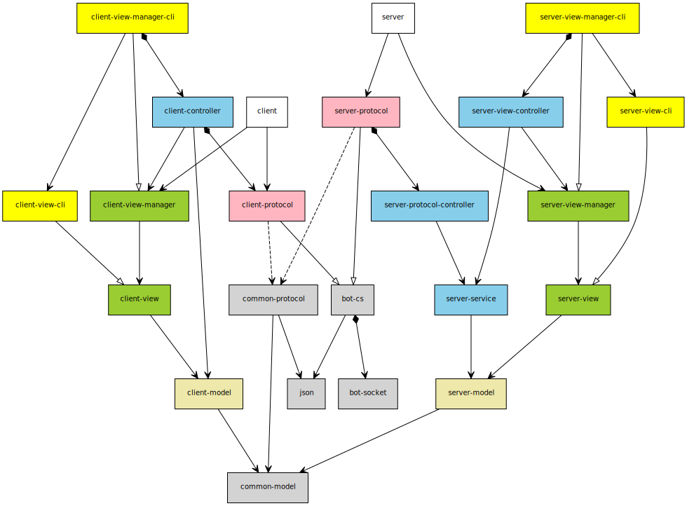

# Air-Conditioner-6-F

> 2017 软件工程大作业

## 文档

1. [需求获取](docs/Requirements.md)
2. [面向对象需求分析](docs/User-cases.md)
3. [结构化需求分析](docs/Requirements-Spec.md)
4. [面向对象设计](docs/OO-Design.md)
5. [结构化设计](docs/Structural.md)

## 依赖图

<!--
[common-protocol{bg:lightgray}]->[common-model{bg:lightgray}]
[common-protocol]->[json{bg:lightgray}]
[bot-cs{bg:lightgray}]->[json]
[bot-cs]++->[bot-socket{bg:lightgray}]

[client-model{bg:palegoldenrod}]->[common-model]
[client-view{bg:yellowgreen}]->[client-model]
[client-view-manager{bg:yellowgreen}]->[client-view]
[client-protocol{bg:lightpink}]-^[bot-cs]
[client-protocol]-.->[common-protocol]
[client-controller{bg:skyblue}]->[client-model]
[client-controller]->[client-view-manager]
[client-controller]++->[client-protocol]
[client]->[client-protocol]
[client]->[client-view-manager]

[client-view-cli{bg:yellow}]-^[client-view]
[client-view-manager-cli{bg:yellow}]-^[client-view-manager]
[client-view-manager-cli]->[client-view-cli]
[client-view-manager-cli]++->[client-controller]

[server-model{bg:palegoldenrod}]->[common-model]
[server-view{bg:yellowgreen}]->[server-model]
[server-view-manager{bg:yellowgreen}]->[server-view]
[server-service{bg:skyblue}]->[server-model]
[server-view-controller{bg:skyblue}]->[server-service]
[server-view-controller]->[server-view-manager]
[server-protocol-controller{bg:skyblue}]->[server-service]
[server-protocol{bg:lightpink}]-^[bot-cs]
[server-protocol]-.->[common-protocol]
[server-protocol]++->[server-protocol-controller]
[server]->[server-view-manager]
[server]->[server-protocol]

[server-view-cli{bg:yellow}]-^[server-view]
[server-view-manager-cli{bg:yellow}]-^[server-view-manager]
[server-view-manager-cli]->[server-view-cli]
[server-view-manager-cli]++->[server-view-controller]
-->