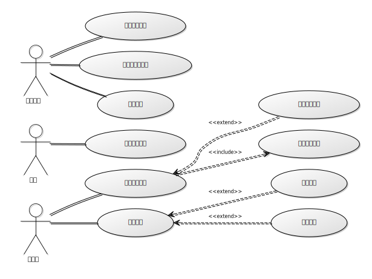
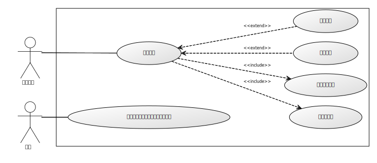
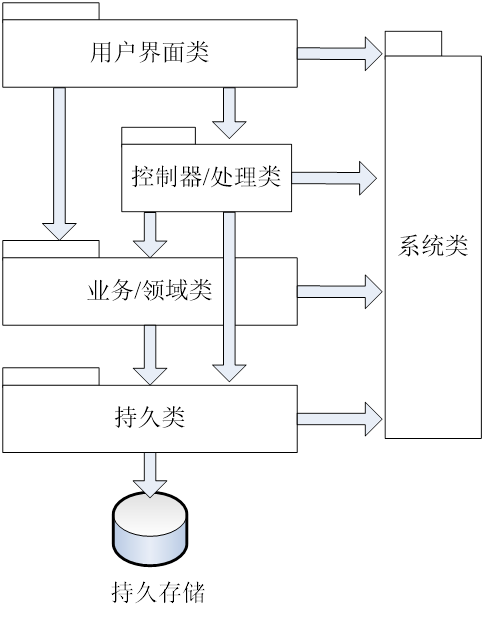
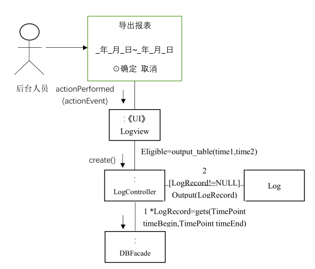
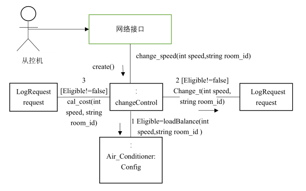

# 分布式温控系统面向对象设计

> 2014211306 班 F 组
>
> 李俊宁 董星彤 张有杰 赵亮 左旭彤
>
> 2017 年 05 月 24 日

[heading-numbering]

## [toc-heading] [no-number] Table of Contents

[TOC]

## [no-number] 迭代历史

> - v0.1 | 2017/5/24 | John Lee | 创建文档
> - v0.2 | 2017/5/27 | 董星彤 | 更新用例图，增加主控机导出报表和调节请求用例的协作图

## 文档说明

### 文档目的

### 文档范围

### 读者对象

### 参考文档

### 术语和缩写

## 项目背景

## 用例模型

### 用例 系统操作

操作名称 | 操作说明
--|--
fn (param:type) | description

## 软件体系结构设计

系统采用分层的体系结构，其软件分层结构如下所示：

## 用例实现方案设计——类职责分配

### 用例

#### fn(param:type)

UC_M_004操作契约

| 操作 | output_table(TimePoint timebegin,TimePoint timeend) |
| :-- | :-- |
| 交叉引用 | 管理报表UC_M_004 |
| 前置条件 | 主控机处于开启状态，后台人员使用主控机并开启报表管理界面 |
| 后置条件 | 1. 一个新的（概念类）报表创建； |
| | 2. 报表与主控机建立“关联”； |
| | 3. 报表的范围属性初始化：时间范围，房间号，客户信息等； |
| | 4. 报表的内容属性被修改，存储了查询结果； |
| | 5. 报表被输出（打印或输出为某种格式） |

UC_M_007操作契约

| 操作 | change_temp(int temp) |
| :-- | :-- |
| 交叉引用 | 从控机调控UC_M_007 |
| 前置条件 | 主控机处于开启状态，从控机向主控机发出调控温度请求 |
| 后置条件 | 1. （概念类）房间空调信息的属性被修改，存储了新的请求； |

| 操作 | change_speed(int speed) |
| :-- | :-- |
| 交叉引用 | 从控机调控UC_M_007 |
| 前置条件 | 主控机处于开启状态，从控机向主控机发出调控风速请求 |
| 后置条件 | 1. （概念类）房间空调信息的属性被修改，存储了新的请求； |

## 用例实现方案设计——创建设计类图

### 用户界面层设计类图

### 控制器/处理层设计类图

### 业务/领域层设计类图

### 持久化层设计类图