# 分布式温控系统面向对象设计

> 2014211306 班 F 组
>
> 李俊宁 董星彤 张有杰 赵亮 左旭彤
>
> 2017 年 05 月 24 日

[heading-numbering]

## [toc-heading] [no-number] Table of Contents

[TOC]

## [no-number] 迭代历史

> - v0.1 | 2017/5/24 | John Lee | 创建文档
> - v0.2 | 2017/5/27 | 董星彤 | 更新用例图，增加主控机导出报表和调节请求用例的协作图
> - v0.3 | 2017/5/28 | John Lee | 增加 类图
> - v0.4 | 2017/5/28 | 左旭彤 | 增加从控机操作契约和协作图
> - v0.5 | 2017/5/28 | 张有杰 | 主控机部分用例
## 文档说明

### 文档目的

### 文档范围

### 读者对象

### 参考文档

### 术语和缩写

## 项目背景

## 用例模型

### 用例 系统操作

操作名称 | 操作说明
--|--
fn (param:type) | description

## 软件体系结构设计

系统采用分层的体系结构，其软件分层结构如下所示：

## 用例实现方案设计——类职责分配

### 用例

### 选项配置更改

#### OpenConfigurationMenu()

> 操作契约

| 操作 | OpenConfigurationMenu() |
| :-- | :-- |
| 交叉引用 | 选项配置更改 UC_M_001 |
| 前置条件 | 主控机处于开启状态，运维人员管理主控机 |
| 后置条件 | 1. 一个新的（概念类）运维人员创建； |
| | 2. 一个新的（概念类）选项配置管理界面创建； |
| | 3. 运维人员与（概念类）主控机建立“关联”； |
| | 4. 运维人员与（概念类）选项配置管理界面建立“关联”； |

> 协作图

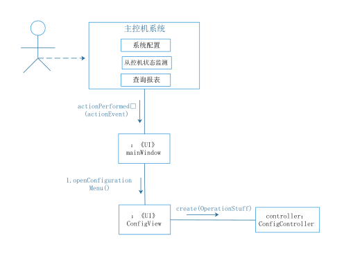

#### StartMachine(GuestInfo guest)

> 操作契约

| 操作 | StartMachine(GuestInfo guest)|
| :-- | :-- |
| 交叉引用 | 主控机开机 UC_M_001_1 |
| 前置条件 | 主控机处于关闭状态 |
| 后置条件 | 1. 一个新的（概念类）主控机欢迎界面创建；|
| | 2. 运维人员与主控机欢迎界面建立“关联”； |

> 协作图

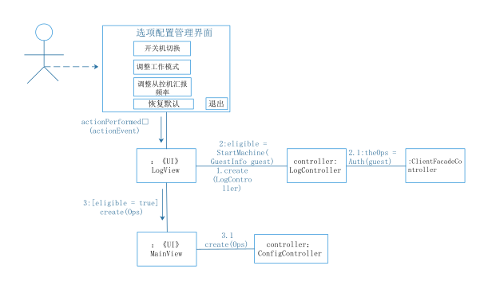

#### QuitSystem()

> 操作契约

| 操作 | QuitSystem()|
| :-- | :-- |
| 交叉引用 | 主控机关机 UC_M_001_2 |
| 前置条件 | 主控机处于开启状态 |
| 后置条件 | 1. 运维人员与主控机功能界面解除“关联”； |
| | 2. (概念类)运维人员消除； |

> 协作图

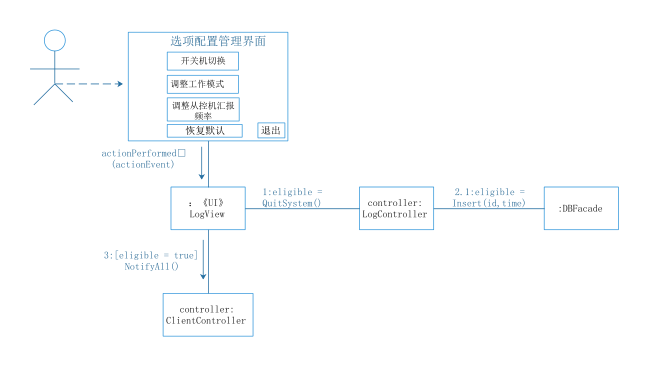

#### AdjustMode(Config TargetMode)

> 操作契约

| 操作 | AdjustMode(Config TargetMode) |
| :-- | :-- |
| 交叉引用 | 选项配置更改 UC_M_002 |
| 前置条件 | 主控机处于开启状态，运维人员选择工作模式 |
| 后置条件 | 1. 一个新的（概念类）工作模式创建； |
| | 2. 工作模式与主控机建立“关联”； |
| | 3. 工作模式被修改； |

> 协作图

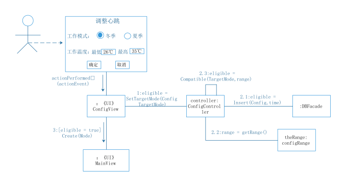

#### AdjustHeartRate(Config NewHeartRate)

> 操作契约

| 操作 | AdjustHeartRate(Config NewHeartRate) |
| :-- | :-- |
| 交叉引用 | 选项配置更改 UC_M_002 |
| 前置条件 | 主控机处于开启状态，运维人员设置从控机心跳频率 |
| 后置条件 | 1. 一个新的（概念类）从控机心跳频率创建； |
| | 2. 从控机心跳频率与主控机建立“关联”； |
| | 3. 设置从控机心跳频率； |

> 协作图

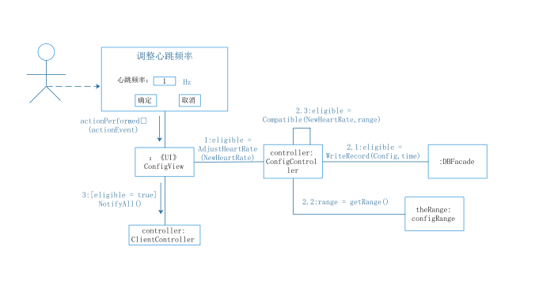

#### SetAllDefault()

> 操作契约

| 操作 | SetAllDefault() |
| :-- | :-- |
| 交叉引用 | 选项配置更改 UC_M_002 |
| 前置条件 | 主控机处于开启状态，运维人员配置主控机选项 |
| 后置条件 | 1. 一个新的（概念类）系统配置创建； |
| | 2. 系统配置与主控机建立“关联”； |
| | 3. 系统配置赋为默认值； |

> 协作图

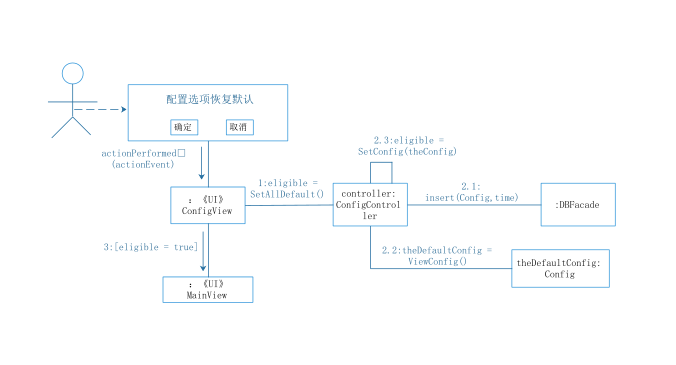

#### CloseConfigMenu()

> 操作契约

| 操作 | CloseConfigMenu() |
| :-- | :-- |
| 交叉引用 | 选项配置更改 UC_M_002 |
| 前置条件 | 主控机处于开启状态，运维人员配置主控机选项 |
| 后置条件 | 1. 运维人员与（概念类）选项配置管理界面解除“关联”； |
| | 2. （概念类）选项配置管理界面消除； |
| | 3. 运维人员与（概念类）主控机解除“关联”； |
| | 4. （概念类）运维人员消除； |

> 协作图

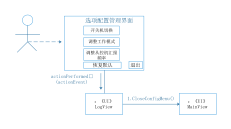

### 监测从控机状态

#### OpenMonitorMenu()

> 操作契约

| 操作 | OpenMonitorMenu() |
| :-- | :-- |
| 交叉引用 | 监测从控机状态 UC_M_003 |
| 前置条件 | 主控机处于开启状态，运维人员监测从控机状态 |
| 后置条件 | 1. 一个新的（概念类）运维人员创建； |
| | 2. 一个新的（概念类）从控机状态监测界面创建； |
| | 3. 运维人员与（概念类）主控机建立“关联”； |
| | 4. 运维人员与（概念类）从控机状态监测界面建立“关联”； |

> 协作图

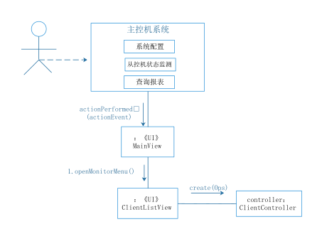

#### DisplayInfo(ClientInfo client)

> 操作契约

| 操作 | DisplayInfo(ClientInfo client) |
| :-- | :-- |
| 交叉引用 | 监测从控机状态 UC_M_003 |
| 前置条件 | 主控机成功获得从控机状态 |
| 后置条件 | 1. 从控机目标温度及设定风速显示 |
| | 2. 从控机当前温度显示|
| | 3. 从控机当前计费及耗能信息显示

> 协作图

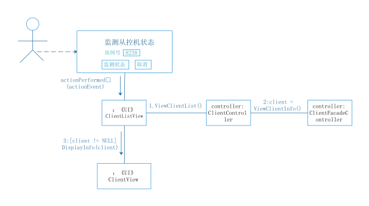

| 操作 | CloseMonitorMenu() |
| :-- | :-- |
| 交叉引用 | 监测从控机状态 UC_M_003 |
| 前置条件 | 主控机成功监测目标从控机状态 |
| 后置条件 | 1. 运维人员与（概念类）从控机状态监测界面解除“关联”； |
| | 2. （概念类）从控机状态监测界面消除； |
| | 3. 运维人员与（概念类）主控机解除“关联”； |
| | 4. （概念类）运维人员消除； |

> 协作图

#### fn(param:type)

UC_M_004操作契约

| 操作 | output_table(TimePoint timebegin,TimePoint timeend) |
| :-- | :-- |
| 交叉引用 | 管理报表UC_M_004 |
| 前置条件 | 主控机处于开启状态，后台人员使用主控机并开启报表管理界面 |
| 后置条件 | 1. 一个新的（概念类）报表创建； |
| | 2. 报表与主控机建立“关联”； |
| | 3. 报表的范围属性初始化：时间范围，房间号，客户信息等； |
| | 4. 报表的内容属性被修改，存储了查询结果； |
| | 5. 报表被输出（打印或输出为某种格式） |

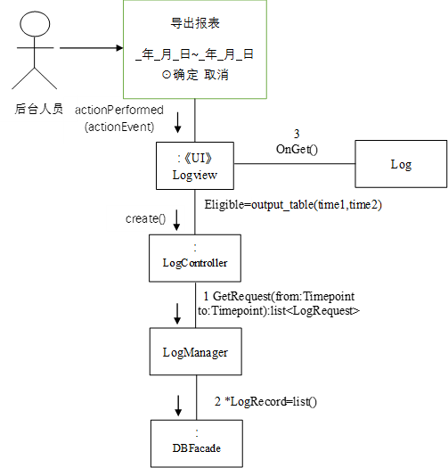

UC_M_007操作契约

| 操作 | change_request(req:GuestRequest) |
| :-- | :-- |
| 交叉引用 | 从控机调控UC_M_007 |
| 前置条件 | 主控机处于开启状态，从控机向主控机发出调控请求 |
| 后置条件 | 1. （概念类）房间空调信息的属性被修改，存储了新的请求； |

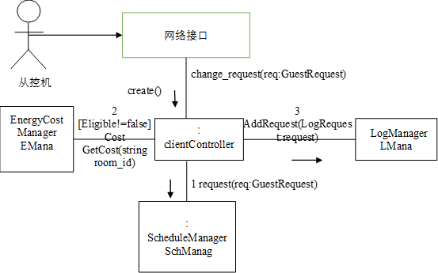

UC_S_001操作契约

| 操作 | BootSlave() |
|:--|:--|
| 交叉引用 | 从控机调控 UC_S_001 |
| 前置条件 | 主控机已经被人工开启，用户去操作控制面板，从控机之前没有收到请求 |
| 后置条件 | 1.从控机与主控机建立关联 |
| | 2.从控机的状态被改变，变为开机状态

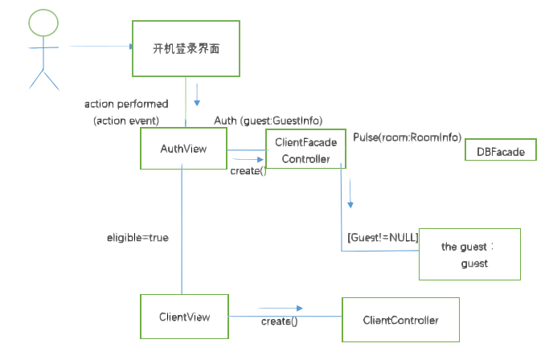

| 操作 | AdjustTandW() |
|:--|:--|
| 交叉引用 | 从控机调控 UC_S_001 |
| 前置条件 | 主控机和从控机都已经被人工开启，用户去操作控制面板 |
| 后置条件 | 1.从控机与房客建立“关联” |
| | 2. 房间温度或者风速被改变

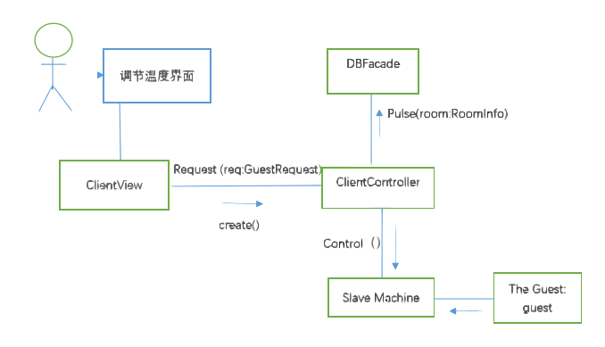

## 用例实现方案设计——创建设计类图

> 图片均为 **矢量图**，请 **放大** 😉

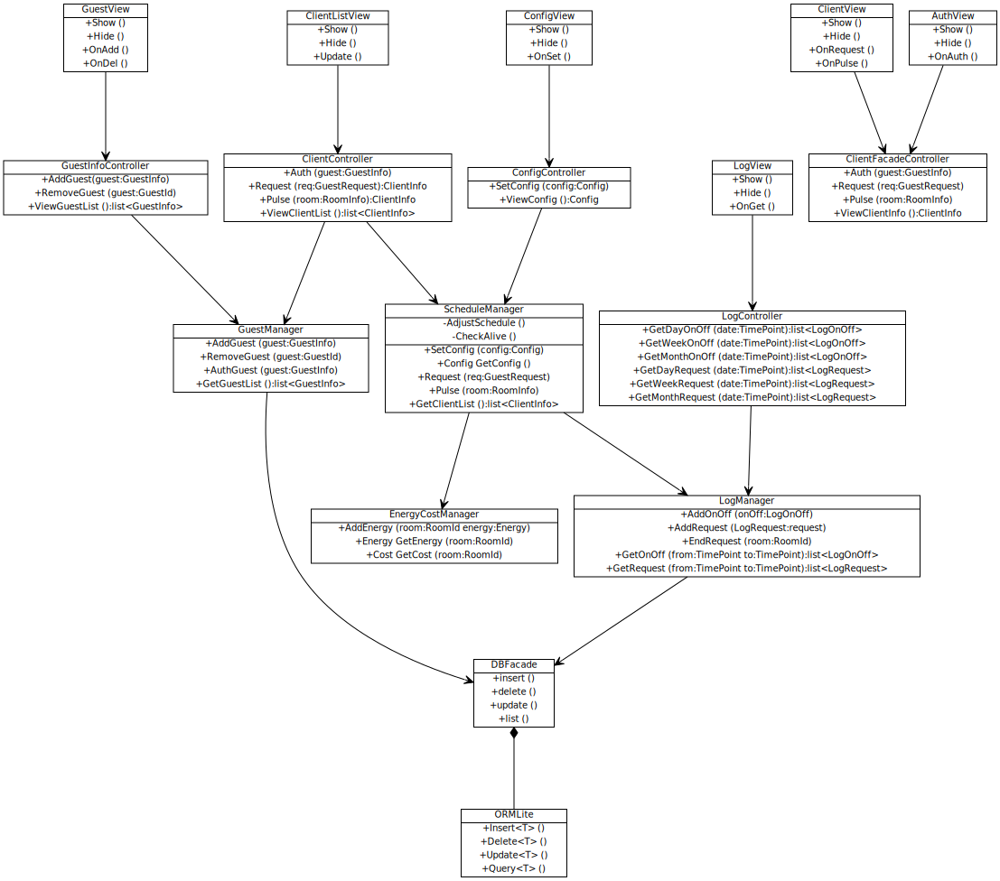

<!--
[ClientFacadeController|+Auth (guest:GuestInfo); +Request (req:GuestRequest); +Pulse (room:RoomInfo); +ViewClientInfo ():ClientInfo],
[AuthView|+Show (); +Hide (); +OnAuth ()]->[ClientFacadeController],
[ClientView|+Show (); +Hide (); +OnRequest (); +OnPulse ()]->[ClientFacadeController],

[DBFacade|+insert (); +delete (); +update (); +list ()]++-[ORMLite|+Insert\<T\> (); +Delete\<T\> (); +Update\<T\> (); +Query\<T\> ()],

[EnergyCostManager|+AddEnergy (room:RoomId energy:Energy); +Energy GetEnergy (room:RoomId); +Cost GetCost (room:RoomId)],
[GuestManager|+AddGuest (guest:GuestInfo); +RemoveGuest (guest:GuestId); +AuthGuest (guest:GuestInfo); +GetGuestList ():list\<GuestInfo\>]->[DBFacade],
[ScheduleManager|-AdjustSchedule (); -CheckAlive ()| +SetConfig (config:Config); +Config GetConfig (); +Request (req:GuestRequest); +Pulse (room:RoomInfo); +GetClientList ():list\<ClientInfo\>]->[LogManager],
[ScheduleManager]->[[EnergyCostManager],
[LogManager|+AddOnOff (onOff:LogOnOff); +AddRequest (LogRequest:request); +EndRequest (room:RoomId); +GetOnOff (from:TimePoint to:TimePoint):list\<LogOnOff\>; +GetRequest (from:TimePoint to:TimePoint):list\<LogRequest\>]->[DBFacade],

[GuestInfoController|+AddGuest(guest:GuestInfo); +RemoveGuest (guest:GuestId); +ViewGuestList ():list\<GuestInfo\>]->[ScheduleManager],
[GuestInfoController]->[GuestManager],
[ConfigController|+SetConfig (config:Config); +ViewConfig ():Config]->[ScheduleManager],
[LogController|+GetDayOnOff (date:TimePoint):list\<LogOnOff\>; +GetWeekOnOff (date:TimePoint):list\<LogOnOff\>; +GetMonthOnOff (date:TimePoint):list\<LogOnOff\>; +GetDayRequest (date:TimePoint):list\<LogRequest\>; +GetWeekRequest (date:TimePoint):list\<LogRequest\>; +GetMonthRequest (date:TimePoint):list\<LogRequest\>]->[LogManager],
[ClientController|+Auth (guest:GuestInfo); +Request (req:GuestRequest):ClientInfo; +Pulse (room:RoomInfo):ClientInfo; +ViewClientList ():list\<ClientInfo\>]->[ScheduleManager],

[GuestView|+Show (); +Hide (); +OnAdd (); +OnDel ()]->[GuestInfoController],
[ConfigView|+Show (); +Hide (); +OnSet ()]->[ConfigController],
[LogView|+Show (); +Hide (); +OnGet ()]->[LogController],
[ClientListView|+Show (); +Hide (); +Update ()]->[ClientController]
-->

### 模型层设计类图

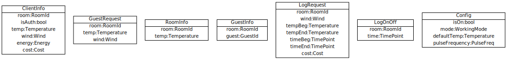

<!--
[Config|isOn:bool; mode:WorkingMode; defaultTemp:Temperature; pulseFrequency:PulseFreq],
[LogOnOff|room:RoomId; time:TimePoint],
[LogRequest|room:RoomId; wind:Wind; tempBeg:Temperature; tempEnd:Temperature; timeBeg:TimePoint; timeEnd:TimePoint; cost:Cost],
[GuestInfo|room:RoomId; guest:GuestId],
[RoomInfo|room:RoomId; temp:Temperature],
[GuestRequest|room:RoomId; temp:Temperature; wind:Wind],
[ClientInfo|room:RoomId; isAuth:bool; temp:Temperature; wind:Wind; energy:Energy; cost:Cost]
-->

### 用户界面层设计类图

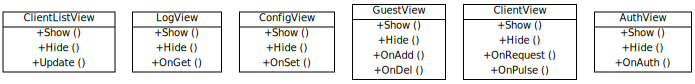

<!--
[AuthView|+Show (); +Hide (); +OnAuth ()],
[ClientView|+Show (); +Hide (); +OnRequest (); +OnPulse ()],
[GuestView|+Show (); +Hide (); +OnAdd (); +OnDel ()],
[ConfigView|+Show (); +Hide (); +OnSet ()],
[LogView|+Show (); +Hide (); +OnGet ()],
[ClientListView|+Show (); +Hide (); +Update ()]
-->

### 控制器/处理层设计类图

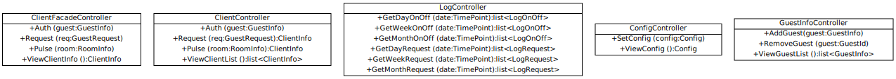

<!--
[GuestInfoController|+AddGuest(guest:GuestInfo); +RemoveGuest (guest:GuestId); +ViewGuestList ():list\<GuestInfo\>],
[ConfigController|+SetConfig (config:Config); +ViewConfig ():Config],
[LogController|+GetDayOnOff (date:TimePoint):list\<LogOnOff\>; +GetWeekOnOff (date:TimePoint):list\<LogOnOff\>; +GetMonthOnOff (date:TimePoint):list\<LogOnOff\>; +GetDayRequest (date:TimePoint):list\<LogRequest\>; +GetWeekRequest (date:TimePoint):list\<LogRequest\>; +GetMonthRequest (date:TimePoint):list\<LogRequest\>],
[ClientController|+Auth (guest:GuestInfo); +Request (req:GuestRequest):ClientInfo; +Pulse (room:RoomInfo):ClientInfo; +ViewClientList ():list\<ClientInfo\>],
[ClientFacadeController|+Auth (guest:GuestInfo); +Request (req:GuestRequest); +Pulse (room:RoomInfo); +ViewClientInfo ():ClientInfo]
-->

### 业务/领域层设计类图

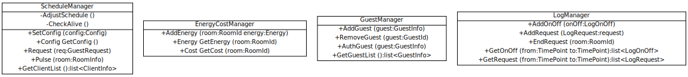

<!--
[LogManager|+AddOnOff (onOff:LogOnOff); +AddRequest (LogRequest:request); +EndRequest (room:RoomId); +GetOnOff (from:TimePoint to:TimePoint):list\<LogOnOff\>; +GetRequest (from:TimePoint to:TimePoint):list\<LogRequest\>],
[GuestManager|+AddGuest (guest:GuestInfo); +RemoveGuest (guest:GuestId); +AuthGuest (guest:GuestInfo); +GetGuestList ():list\<GuestInfo\>],
[EnergyCostManager|+AddEnergy (room:RoomId energy:Energy); +Energy GetEnergy (room:RoomId); +Cost GetCost (room:RoomId)],
[ScheduleManager|-AdjustSchedule (); -CheckAlive ()| +SetConfig (config:Config); +Config GetConfig (); +Request (req:GuestRequest); +Pulse (room:RoomInfo); +GetClientList ():list\<ClientInfo\>]
-->

### 持久化层设计类图

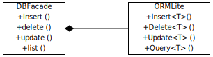

<!--
[DBFacade|+insert (); +delete (); +update (); +list ()]++-[ORMLite|+Insert\<T\> (); +Delete\<T\> (); +Update\<T\> (); +Query\<T\> ()]
-->