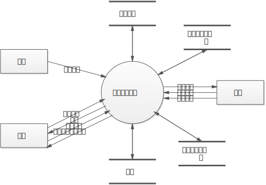
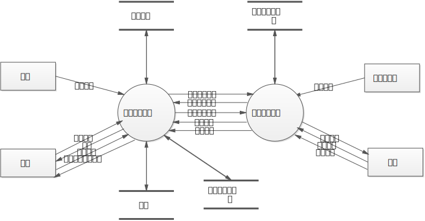
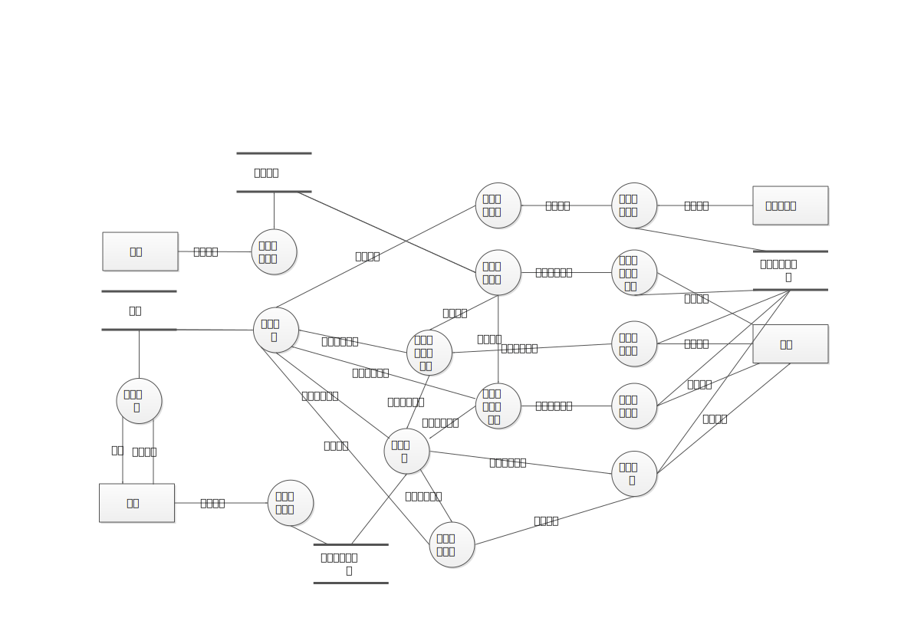

# 分布式温控系统软件需求规格说明书

> 2014211306 班 F 组
>
> 李俊宁 董星彤 张有杰 赵亮 左旭彤
>
> 2017 年 05 月 11 日

[heading-numbering]

## [toc-heading] [no-number] Table of Contents

[TOC]

## [no-number] 迭代历史

> - v0.1 | 2017/5/11 | John Lee | 创建文档
> - v0.2 | 2017/5/11 | 董星彤 左旭彤 | 增加数据流和数据元素部分
> - v0.3 | 2017/5/11 | 董星彤 | 增加数据流图

[page-break]

## 引言

### 编写目的

> 说明编写目的并指明读者对象。

### 项目背景

> 说明项目的委托单位、开发单位和主管部门。
> 该系统与其他系统的关系。

### 词汇

> 列出文档中所使用的专业术语的定义和缩写词的原文含义。

### 书写规范

> 说明需求文档的结构以及需求分析所使用的方法。

## 系统概述

### 系统建设目标

> 根据用户提供的需求书内容，描述系统建设的总体和分阶段目标。

### 系统运行环境

> 给出系统运行所必需的硬件和软件环境和配置要求。

### 条件和限制

> 根据系统阶段性建设目标给出系统建设和运行的前提条件及其它限制约束。

## 系统功能需求

### 业务背景描述

> 描述业务背景、业务的组织结构以及业务流程，即问题分析的成果。

### 系统功能需求

> 根据业务背景，给出系统的层次化数据流图并给出结合层次的数据流图给出相应层次的数据词典。

#### 第 0 层数据流图

#####	数据流图

##### 数据词典

1．外部实体
  - 酒店前台
  - 酒店后台
  - 房客
2．数据流

| 数据流名称 | 房客信息 |
| :-- | :-- |
| 简要描述 | 前台人员从房客处获取房客信息，录入系统 |
| 数据流来源 | 外部实体“前台” |
| 数据流去向 | 加工“中央空调系统” |
| 数据流组成 | 房间号 + 房客身份证号 + 入住日期 + 退房日期 |
| 备注 | |

| 数据流名称 | 日志查询请求 |
| :-- | :-- |
| 简要描述 | 后台人员请求查询日志信息 |
| 数据流来源 | 外部实体“后台” |
| 数据流去向 | 加工“中央空调系统” |
| 数据流组成 | 请求报表类型 |
| 备注 | |

| 数据流名称 | 日志 |
| :-- | :-- |
| 简要描述 | 后台人员请求查询日志信息后，“管理日志”加工返回日志信息 |
| 数据流来源 | 加工“中央空调系统” |
| 数据流去向 | 外部实体“后台” |
| 数据流组成 | 房间号 + 从控机开关机的次数 + { 温控请求开始时间 + 温控请求停止时间 + 温控请求的起止温度 + 风量大小 + 每次温控请求所需费用 } + [ 每日，每周，每月所需总费用 ] |
| 备注 | |

| 数据流名称 | 主控机配置信息 |
| :-- | :-- |
| 简要描述 | 后台人员对配置信息进行修改 |
| 数据流来源 | 外部实体“后台” |
| 数据流去向 | 加工“中央空调系统” |
| 数据流组成 | （主控机开关） + （工作模式） + （缺省工作温度） + （刷新频率） |
| 备注 | |

| 数据流名称 | 登录信息 |
| :-- | :-- |
| 简要描述 | 房客将自己的房间号和身份信息输入到中央空调系统 |
| 数据流来源 | 实体“房客” |
| 数据流去向 | 加工“中央空调系统” |
| 数据流组成 | 房间号+房客身份证号 |
| 备注 | |

| 数据流名称 | 状态信息 |
| :-- | :-- |
| 简要描述 | 中央空调系统将当前房间信息显示给房客 |
| 数据流来源 | 加工“中央空调系统” |
| 数据流去向 | 实体“房客” |
| 数据流组成 | 房间号+房间温度+风速+能耗+费用 |
| 备注 | |

| 数据流名称 | 目标状态 |
| :-- | :-- |
| 简要描述 | 房客将希望调节的风速和温度信息发给中央空调系统 |
| 数据流来源 | 实体“房客” |
| 数据流去向 | 加工“中央空调系统” |
| 数据流组成 | 房间目标温度+风速 |
| 备注 | |

3．数据元素

| 数据元素名称 | 房间号 |
| :-- | :-- |
| 简要描述 | 空调从控机所在的房间号，位于“日志”，“房客信息”数据结构内 |
| 类型 | 数字 |
| 长度 | 4位数字 |
| 取值范围 | 0101-1020 |
| 备注 | |

| 数据元素名称 | 从控机开关机的次数 |
| :-- | :-- |
| 简要描述 | 某房间内从控机开关机次数，位于“日志”数据结构内 |
| 类型 | 数字 |
| 长度 | 整数 |
| 取值范围 | 大于0 |
| 备注 | |

| 数据元素名称 | 时间 |
| :-- | :-- |
| 简要描述 | 某一请求的时间，位于“日志”，“房客信息”数据结构内 |
| 类型 | 年 + 月 + 日 + 时 + 分 + 秒 |
| 长度 | 14 |
| 取值范围 | 年="0000".."9999"； 月="01".."12"; 日="01".."31"; 时="00".."23"; 分="01".."60"; 秒="01".."60"; |
| 备注 | |

| 数据元素名称 | 费用 |
| :-- | :-- |
| 简要描述 | 某一请求的总费用，位于“日志”数据结构内 |
| 类型 | 浮点数 |
| 长度 | 小数点后最多两位，小数点前不限 |
| 取值范围 | 大于0.00 |
| 备注 | |

| 数据元素名称 | 总费用 |
| :-- | :-- |
| 简要描述 | 每日，每周，每月所需总费用，位于“日志”数据结构内 |
| 类型 | 浮点数 |
| 长度 | 小数点后最多两位，小数点前不限 |
| 取值范围 | 大于0.00 |
| 备注 | 总费用等于所有请求的费用之和 |

| 数据元素名称 | 请求报表类型 |
| :-- | :-- |
| 简要描述 | 请求查看年报表，月报表或日报表，位于“请求日志”数据结构内 |
| 类型 | 整型 |
| 长度 | 1 |
| 取值范围 | 年报表=1；月报表=2；日报表=3； 请求报表类型=[ 年报表，月报表，日报表 ] |
| 备注 | |

| 数据元素名称 | 主控机开关状态 |
| :-- | :-- |
| 简要描述 | 主控机当前运行状态，位于“配置信息”数据结构内 |
| 类型 | 布尔型 |
| 长度 | 1 |
| 取值范围 | 开启=1；关闭=0； 主控机开关状态=[ 开启，关闭 ] |
| 备注 | |

| 数据元素名称 | 工作模式 |
| :-- | :-- |
| 简要描述 | 主控机当前工作模式，位于“配置信息”数据结构内 |
| 类型 | 布尔型 |
| 长度 | 1 |
| 取值范围 | 制热=1；制冷=0； 工作模式=[ 制热，制冷 ] |
| 备注 | |

| 数据元素名称 | 刷新频率 |
| :-- | :-- |
| 简要描述 | 主控机获取房间信息的频率，位于“配置信息”数据结构内 |
| 类型 | 整型 |
| 长度 | 2 |
| 取值范围 | "1".."99" |
| 备注 | 单位：秒 |

| 数据元素名称 | 房间温度 |
| :-- | :-- |
| 简要描述 | 可以反映此时房间的温度，位于“状态信息” 数据结构内 |
| 类型 | 数字 |
| 长度 | 两位数字 |
| 取值范围 | "00".."99" |
| 备注 | 单位：摄氏度 |

| 数据元素名称 | 房间目标温度 |
| :-- | :-- |
| 简要描述 | 可以反映房客需要调节的温度，位于“目标状态” “日志”数据结构内 |
| 类型 | 数字 |
| 长度 | 两位数字 |
| 取值范围 | "18".."30" |
| 备注 | 单位：摄氏度 |

| 数据元素名称 | 房客身份证号 |
| :-- | :-- |
| 简要描述 | 输入以完成房客身份认证，位于“登录信息”数据结构内 |
| 类型 | 数字 |
| 长度 | 十八位字符 |
| 取值范围 | "000000000000000000".."999999999999999999" |
| 备注 | |

| 数据元素名称 | 风速 |
| :-- | :-- |
| 简要描述 | 反映房间的风速信息，位于“状态信息” “日志” “目标状态”数据结构内 |
| 类型 | 数字 |
| 长度 | 一位数字 |
| 取值范围 | 高风速=0，中风速=1，低风速=2，风速=[0,1,2] |
| 备注 | |

4．数据文件
  - 房客信息
  - 日志
5．加工
  - 中央空调系统

#### 第 1 层数据流图

#####	数据流图

##### 数据词典

1．外部实体
  - 酒店前台
  - 酒店后台
  - 房客
  - ..（同上）
  - 温度传感器
2．数据流
  
| 数据流名称 | 房客信息 |
| :-- | :-- |
| 简要描述 | 前台人员从房客处获取房客信息，录入系统 |
| 数据流来源 | 外部实体“前台” |
| 数据流去向 | 加工“主控机子系统” |
| 数据流组成 | 房间号 + 房客身份证号 + 入住日期 + 退房日期 |
| 备注 | |

| 数据流名称 | 日志查询请求 |
| :-- | :-- |
| 简要描述 | 后台人员请求查询日志信息 |
| 数据流来源 | 外部实体“后台” |
| 数据流去向 | 加工“主控机子系统” |
| 数据流组成 | 请求报表类型 |
| 备注 | |

| 数据流名称 | 日志 |
| :-- | :-- |
| 简要描述 | 后台人员请求查询日志信息后，“管理日志”加工返回日志信息 |
| 数据流来源 | 加工“主控机子系统” |
| 数据流去向 | 外部实体“后台” |
| 数据流组成 | 房间号 + 从控机开关机的次数 + { 温控请求开始时间 + 温控请求停止时间 + 温控请求的起止温度 + 风量大小 + 每次温控请求所需费用 } + [ 每日，每周，每月所需总费用 ] |
| 备注 | |

| 数据流名称 | 主控机配置信息 |
| :-- | :-- |
| 简要描述 | 后台人员对配置信息进行修改 |
| 数据流来源 | 外部实体“后台” |
| 数据流去向 | 加工“主控机子系统” |
| 数据流组成 | （主控机开关） + （工作模式） + （缺省工作温度） + （刷新频率） |
| 备注 | |

| 数据流名称 | 费用能耗信息 |
| :-- | :-- |
| 简要描述 | 主控机根据空调当前状态计算出能耗和费用，并将信息发给从控机 |
| 数据流来源 | 加工“主控机子系统” |
| 数据流去向 | 加工“从控机子系统” |
| 数据流组成 | 房间号 + 费用 + 能耗 |
| 备注 | |

| 数据流名称 | 空调运行状态 |
| :-- | :-- |
| 简要描述 | 空调运行的状态 |
| 数据流来源 | 加工“主控机子系统” |
| 数据流去向 | 加工“从控机子系统” |
| 数据流组成 | 房间号 + 温度 + 风速 |
| 备注 | |

| 数据流名称 | 调节请求 |
| :-- | :-- |
| 简要描述 | 从控机将调节请求发送给主控机 |
| 数据流来源 | 加工“从控机子系统” |
| 数据流去向 | 加工“主控机子系统” |
| 数据流组成 | 房间号 + 温度 + 风速 |
| 备注 | |

| 数据流名称 | 房间温度 |
| :-- | :-- |
| 简要描述 |温度传感器可以将获得的温度发给主控机 |
| 数据流来源 | 实体“温度传感器” |
| 数据流去向 | 加工“从控机子系统” |
| 数据流组成 | 房间温度 |
| 备注 | |

| 数据流名称 | 登录信息 |
| :-- | :-- |
| 简要描述 | 房客将自己的房间号和身份信息输入到从控机房客身份认证界面 |
| 数据流来源 | 实体“房客” |
| 数据流去向 | 加工“从控机子系统” |
| 数据流组成 | 房间号+房客身份证号 |
| 备注 | |

| 数据流名称 | 状态信息 |
| :-- | :-- |
| 简要描述 | 从控机显示界面将当前房间信息显示给房客 |
| 数据流来源 | 加工“从控机子系统” |
| 数据流去向 | 实体“房客” |
| 数据流组成 | 房间号+房间温度+风速+能耗+费用 |
| 备注 | |

| 数据流名称 | 目标状态 |
| :-- | :-- |
| 简要描述 | 房客将希望调节的风速和温度信息发给从控机子系统 |
| 数据流来源 | 实体“房客” |
| 数据流去向 | 加工“从控机子系统” |
| 数据流组成 | 房间目标温度+风速 |
| 备注 | |

| 数据流名称 | 身份认证信息 |
| :-- | :-- |
| 简要描述 | 从控机将所获取的身份认证信息发给主控机，主控机进行认证，判断是否可以完成空调使用的授权 |
| 数据流来源 | 加工“从控机子系统” |
| 数据流去向 | 加工“主控机子系统” |
| 数据流组成 | 房间号+房客身份证号 |
| 备注 | |

| 数据流名称 | 房间状态 |
| :-- | :-- |
| 简要描述 | 从控机将所获取的房间状态发给主控机 |
| 数据流来源 | 加工“从控机子系统” |
| 数据流去向 | 加工“主控机子系统” |
| 数据流组成 | 房间温度+风速 |
| 备注 | |

3．数据元素

| 数据元素名称 | 房间号 |
| :-- | :-- |
| 简要描述 | 空调从控机所在的房间号，位于“日志”，“房客信息”，“空调运行状态”，“费用能耗信息”，“调节请求”数据结构内 |
| 类型 | 数字 |
| 长度 | 4位数字 |
| 取值范围 | 0101-1020 |
| 备注 | |

| 数据元素名称 | 从控机开关机的次数 |
| :-- | :-- |
| 简要描述 | 某房间内从控机开关机次数，位于“日志”数据结构内 |
| 类型 | 数字 |
| 长度 | 整数 |
| 取值范围 | 大于0 |
| 备注 | |

| 数据元素名称 | 时间 |
| :-- | :-- |
| 简要描述 | 某一请求的时间，位于“日志”，“房客信息”数据结构内 |
| 类型 | 年 + 月 + 日 + 时 + 分 + 秒 |
| 长度 | 14 |
| 取值范围 | 年="0000".."9999"； 月="01".."12"; 日="01".."31"; 时="00".."23"; 分="01".."60"; 秒="01".."60"; |
| 备注 | |

| 数据元素名称 | 费用 |
| :-- | :-- |
| 简要描述 | 某一请求的总费用，位于“日志”，“费用能耗信息”数据结构内 |
| 类型 | 浮点数 |
| 长度 | 小数点后最多两位，小数点前不限 |
| 取值范围 | 大于0.00 |
| 备注 | |

| 数据元素名称 | 总费用 |
| :-- | :-- |
| 简要描述 | 每日，每周，每月所需总费用，位于“日志”数据结构内 |
| 类型 | 浮点数 |
| 长度 | 小数点后最多两位，小数点前不限 |
| 取值范围 | 大于0.00 |
| 备注 | 总费用等于所有请求的费用之和 |

| 数据元素名称 | 请求报表类型 |
| :-- | :-- |
| 简要描述 | 请求查看年报表，月报表或日报表，位于“请求日志”数据结构内 |
| 类型 | 整型 |
| 长度 | 1 |
| 取值范围 | 年报表=1；月报表=2；日报表=3； 请求报表类型=[ 年报表，月报表，日报表 ] |
| 备注 | |

| 数据元素名称 | 主控机开关状态 |
| :-- | :-- |
| 简要描述 | 主控机当前运行状态，位于“主控机配置信息”数据结构内 |
| 类型 | 布尔型 |
| 长度 | 1 |
| 取值范围 | 开启=1；关闭=0； 主控机开关状态=[ 开启，关闭 ] |
| 备注 | |

| 数据元素名称 | 工作模式 |
| :-- | :-- |
| 简要描述 | 主控机当前工作模式，位于“主控机配置信息”数据结构内 |
| 类型 | 布尔型 |
| 长度 | 1 |
| 取值范围 | 制热=1；制冷=0； 工作模式=[ 制热，制冷 ] |
| 备注 | |

| 数据元素名称 | 刷新频率 |
| :-- | :-- |
| 简要描述 | 主控机获取房间信息的频率，位于“主控机配置信息”数据结构内 |
| 类型 | 整型 |
| 长度 | 2 |
| 取值范围 | "1".."99" |
| 备注 | 单位：秒 |

| 数据元素名称 | 能耗 |
| :-- | :-- |
| 简要描述 | 空调运行能耗，位于“状态信息”，“费用能耗信息”数据结构内 |
| 类型 | 整型 |
| 长度 | 8 |
| 取值范围 | "1".."99999999" |
| 备注 |  |

| 数据元素名称 | 房间温度 |
| :-- | :-- |
| 简要描述 | 可以反映此时房间的温度，位于“房间温度” “状态信息” “房间状态”数据结构内 |
| 类型 | 数字 |
| 长度 | 两位数字 |
| 取值范围 | "00".."99" |
| 备注 | 单位：摄氏度 |

| 数据元素名称 | 房间目标温度 |
| :-- | :-- |
| 简要描述 | 可以反映房客需要调节的温度，位于“目标状态” “日志”数据结构内 |
| 类型 | 数字 |
| 长度 | 两位数字 |
| 取值范围 | "18".."30" |
| 备注 | 单位：摄氏度 |

| 数据元素名称 | 房客身份证号 |
| :-- | :-- |
| 简要描述 | 输入以完成房客身份认证，位于“登录信息” “身份认证信息”数据结构内 |
| 类型 | 数字 |
| 长度 | 十八位字符 |
| 取值范围 | "000000000000000000".."999999999999999999" |
| 备注 | |

| 数据元素名称 | 风速 |
| :-- | :-- |
| 简要描述 | 反映房间的风速信息，位于“状态信息” “日志” “目标状态” “房间状态” 数据结构内 |
| 类型 | 数字 |
| 长度 | 一位数字 |
| 取值范围 | 高风速=0，中风速=1，低风速=2，风速=[0,1,2] |
| 备注 | |

4．数据文件
  - 房客信息
  - 日志
5．加工
  - 主控机子系统
  - 从控机子系统

#### 第 2 层数据流图

#####	数据流图

##### 数据词典

1．外部实体
  - 酒店前台
  - 酒店后台
  - 房客
  - 温度传感器
2．数据流

| 数据流名称 | 日志查询请求 |
| :-- | :-- |
| 简要描述 | 后台人员请求查询日志信息 |
| 数据流来源 | 外部实体“后台” |
| 数据流去向 | 加工“管理日志” |
| 数据流组成 | 请求报表类型 |
| 备注 | |

| 数据流名称 | 日志 |
| :-- | :-- |
| 简要描述 | 后台人员请求查询日志信息后，“管理日志”加工返回日志信息 |
| 数据流来源 | 加工“管理日志” |
| 数据流去向 | 外部实体“后台” |
| 数据流组成 | 房间号 + 从控机开关机的次数 + { 温控请求开始时间 + 温控请求停止时间 + 温控请求的起止温度 + 风量大小 + 每次温控请求所需费用 } + [ 每日，每周，每月所需总费用 ] |
| 备注 | |

| 数据流名称 | 主控机配置信息 |
| :-- | :-- |
| 简要描述 | 后台人员对配置信息进行修改 |
| 数据流来源 | 外部实体“后台” |
| 数据流去向 | 加工“配置空调参数” |
| 数据流组成 | （主控机开关） + （工作模式） + （缺省工作温度） + （刷新频率） |
| 备注 | |

| 数据流名称 | 房客信息 |
| :-- | :-- |
| 简要描述 | 前台人员从房客处获取房客信息，录入系统 |
| 数据流来源 | 外部实体“前台” |
| 数据流去向 | 加工“管理房客信息” |
| 数据流组成 | 房间号 + 房客身份证号 + 入住日期 + 退房日期 |
| 备注 | |

| 数据流名称 | 费用能耗信息 |
| :-- | :-- |
| 简要描述 | 根据空调当前状态计算出能耗和费用 |
| 数据流来源 | 加工“能耗费用计算” |
| 数据流去向 | 加工“生成日志”，“显示信息” |
| 数据流组成 | 房间号 + 费用 + 能耗 |
| 备注 | |

| 数据流名称 | 空调运行状态 |
| :-- | :-- |
| 简要描述 | 空调运行的状态 |
| 数据流来源 | 加工“负载均衡” |
| 数据流去向 | 加工“能耗费用计算”，“显示信息”，“生成日志” |
| 数据流组成 | 房间号 + 温度 + 风速 |
| 备注 | |

| 数据流名称 | 使用授权 |
| :-- | :-- |
| 简要描述 | 房客登录成功后授权给调节模块，此时调节模块才能接受从控机的调节请求，否则不接受 |
| 数据流来源 | 加工“房客登录认证” |
| 数据流去向 | 加工“接收温度调节信息”，“接收风速调节信息” |
| 数据流组成 | 房间号 + 使用权限 |
| 备注 | |

| 数据流名称 | 风速调节请求 |
| :-- | :-- |
| 简要描述 | 从控机将风速调节请求发送给主控机 |
| 数据流来源 | 加工“界面调节风速” |
| 数据流去向 | 加工“接收风速调节信息” |
| 数据流组成 | 房间号 + 风速 |
| 备注 | |

| 数据流名称 | 风速调节请求 |
| :-- | :-- |
| 简要描述 | 主控机接收到风速调解请求后将请求信息发送到日志生成模块，若该房间房客有使用权限，则再将请求发送到负载均衡模块 |
| 数据流来源 | 加工“接收风速调节信息” |
| 数据流去向 | 加工“生成日志”，“负载均衡” |
| 数据流组成 | 房间号+风速 |
| 备注 | |

| 数据流名称 | 房间温度 |
| :-- | :-- |
| 简要描述 |温度传感器可以将获得的温度发给主控机 |
| 数据流来源 | 实体“温度传感器” |
| 数据流去向 | 加工“发送房间信息” |
| 数据流组成 | 房间温度 |
| 备注 | |

| 数据流名称 | 房间信息 |
| :-- | :-- |
| 简要描述 | 从控机将获取的房间温度传给主控机，主控机根据温度和房间号将房间信息进行更新 |
| 数据流来源 | 加工“发送房间信息” |
| 数据流去向 | 加工“房间信息更新” |
| 数据流组成 | 房间温度+房间号 |
| 备注 | |

| 数据流名称 | 房间温度调节信息 |
| :-- | :-- |
| 简要描述 | 根据房间信息更新日志 |
| 数据流来源 | 加工“房间信息更新” |
| 数据流去向 | 加工“生成日志” |
| 数据流组成 | 房间温度+房间号 |
| 备注 | |

| 数据流名称 | 目标温度 |
| :-- | :-- |
| 简要描述 | 用户将所要调节的目标温度输入到从控机温度控制界面 |
| 数据流来源 | 实体“房客” |
| 数据流去向 | 加工“界面调节温度” |
| 数据流组成 | 目标温度 |
| 备注 | |

| 数据流名称 | 登录信息 |
| :-- | :-- |
| 简要描述 | 房客将自己的房间号和身份信息输入到从控机房客身份认证界面 |
| 数据流来源 | 实体“房客” |
| 数据流去向 | 加工“界面房客身份认证” |
| 数据流组成 | 房间号+房客身份证号 |
| 备注 | |

| 数据流名称 | 状态信息 |
| :-- | :-- |
| 简要描述 | 从控机显示界面将当前房间信息显示给房客 |
| 数据流来源 | 加工“显示信息” |
| 数据流去向 | 实体“房客” |
| 数据流组成 | 房间号+房间温度+风速+能耗+费用 |
| 备注 | |

| 数据流名称 | 身份认证信息 |
| :-- | :-- |
| 简要描述 | 从控机将所获取的身份认证信息发给主控机，主控机进行认证，判断是否可以完成空调使用的授权 |
| 数据流来源 | 加工“界面房客身份认证” |
| 数据流去向 | 加工“房客登录认证” |
| 数据流组成 | 房间号+身份证号 |
| 备注 | |

| 数据流名称 | 温度调节请求 |
| :-- | :-- |
| 简要描述 | 主控机接收来自从控机的用户选择的目标温度的信息 |
| 数据流来源 | 加工“界面调节温度” |
| 数据流去向 | 加工“接收温度调节信息” |
| 数据流组成 | 房间号+房间目标温度 |
| 备注 | |

| 数据流名称 | 温度调节请求 |
| :-- | :-- |
| 简要描述 | 用来自主控机的温度调节请求更新日志 |
| 数据流来源 | 加工“接收温度调节信息” |
| 数据流去向 | 加工“生成日志” |
| 数据流组成 | 房间号+房间目标温度 |
| 备注 | |

| 数据流名称 | 温度调节请求 |
| :-- | :-- |
| 简要描述 | 使得来自主控机的温度调节请求满足负载均衡 |
| 数据流来源 | 加工“接收温度调节信息” |
| 数据流去向 | 加工“负载均衡” |
| 数据流组成 | 房间号+房间目标温度 |
| 备注 | |

3．数据元素

| 数据元素名称 | 房间号 |
| :-- | :-- |
| 简要描述 | 空调从控机所在的房间号，位于“日志”，“登录信息”，“身份认证信息”，“使用授权”，“空调运行状态”，“费用能耗信息”，“风速调解请求”，“温度调解请求”数据结构内 |
| 类型 | 数字 |
| 长度 | 4位数字 |
| 取值范围 | 0101-1020 |
| 备注 | |

| 数据元素名称 | 从控机开关机的次数 |
| :-- | :-- |
| 简要描述 | 某房间内从控机开关机次数，位于“日志”数据结构内 |
| 类型 | 数字 |
| 长度 | 整数 |
| 取值范围 | 大于0 |
| 备注 | |

| 数据元素名称 | 时间 |
| :-- | :-- |
| 简要描述 | 某一请求的时间，位于“日志”，“房客信息”数据结构内 |
| 类型 | 年 + 月 + 日 + 时 + 分 + 秒 |
| 长度 | 14 |
| 取值范围 | 年="0000".."9999"； 月="01".."12"; 日="01".."31"; 时="00".."23"; 分="01".."60"; 秒="01".."60"; |
| 备注 | |

| 数据元素名称 | 费用 |
| :-- | :-- |
| 简要描述 | 某一请求的总费用，位于“日志”，“费用能耗信息”数据结构内 |
| 类型 | 浮点数 |
| 长度 | 小数点后最多两位，小数点前不限 |
| 取值范围 | 大于0.00 |
| 备注 | |

| 数据元素名称 | 总费用 |
| :-- | :-- |
| 简要描述 | 每日，每周，每月所需总费用，位于“日志”数据结构内 |
| 类型 | 浮点数 |
| 长度 | 小数点后最多两位，小数点前不限 |
| 取值范围 | 大于0.00 |
| 备注 | 总费用等于所有请求的费用之和 |

| 数据元素名称 | 请求报表类型 |
| :-- | :-- |
| 简要描述 | 请求查看年报表，月报表或日报表，位于“请求日志”数据结构内 |
| 类型 | 整型 |
| 长度 | 1 |
| 取值范围 | 年报表=1；月报表=2；日报表=3； 请求报表类型=[ 年报表，月报表，日报表 ] |
| 备注 | |

| 数据元素名称 | 主控机开关状态 |
| :-- | :-- |
| 简要描述 | 主控机当前运行状态，位于“主控机配置信息”数据结构内 |
| 类型 | 布尔型 |
| 长度 | 1 |
| 取值范围 | 开启=1；关闭=0； 主控机开关状态=[ 开启，关闭 ] |
| 备注 | |

| 数据元素名称 | 工作模式 |
| :-- | :-- |
| 简要描述 | 主控机当前工作模式，位于“主控机配置信息”数据结构内 |
| 类型 | 布尔型 |
| 长度 | 1 |
| 取值范围 | 制热=1；制冷=0； 工作模式=[ 制热，制冷 ] |
| 备注 | |

| 数据元素名称 | 刷新频率 |
| :-- | :-- |
| 简要描述 | 主控机获取房间信息的频率，位于“主控机配置信息”数据结构内 |
| 类型 | 整型 |
| 长度 | 2 |
| 取值范围 | "1".."99" |
| 备注 | 单位：秒 |

| 数据元素名称 | 能耗 |
| :-- | :-- |
| 简要描述 | 空调运行能耗，位于“状态信息”，“费用能耗信息”数据结构内 |
| 类型 | 整型 |
| 长度 | 8 |
| 取值范围 | "1".."99999999" |
| 备注 |  |

| 数据元素名称 | 使用权限 |
| :-- | :-- |
| 简要描述 | 调节空调的权限，位于“使用授权”数据结构内 |
| 类型 | 布尔型 |
| 长度 | 1 |
| 取值范围 | 允许调节=1；禁止调节=0； 使用权限=[ 允许调节，禁止调节 ] |
| 备注 |  |

| 数据元素名称 | 房间温度 |
| :-- | :-- |
| 简要描述 | 可以反映此时房间的温度，位于“房间温度” “房间温度调节信息”数据结构内 |
| 类型 | 数字 |
| 长度 | 两位数字 |
| 取值范围 | "00".."99" |
| 备注 | 单位：摄氏度 |

| 数据元素名称 | 房间目标温度 |
| :-- | :-- |
| 简要描述 | 可以反映房客需要调节的温度，位于“房间目标温度” “日志”数据结构内 |
| 类型 | 数字 |
| 长度 | 两位数字 |
| 取值范围 | "18".."30" |
| 备注 | 单位：摄氏度 |

| 数据元素名称 | 房客身份证号 |
| :-- | :-- |
| 简要描述 | 输入以完成房客身份认证，位于“登录信息” “房客信息” “身份认证信息”数据结构内 |
| 类型 | 数字 |
| 长度 | 十八位字符 |
| 取值范围 | "000000000000000000".."999999999999999999" |
| 备注 | |

| 数据元素名称 | 风速 |
| :-- | :-- |
| 简要描述 | 反映房间的风速信息，位于“状态信息” “日志”数据结构内 |
| 类型 | 数字 |
| 长度 | 一位数字 |
| 取值范围 | 高风速=0，中风速=1，低风速=2，风速=[0,1,2] |
| 备注 | |

4．数据文件
  - 房客信息
  - 日志
5．加工

### 系统数据模型

> 给出系统初步的数据模型，即ER图。

### 系统性能要求

#### 数据精确度

#### 时间特性

> 如响应时间、更新处理时间、数据转换与传输时间、运行时间等。

#### 适应性

> 在操作方式、运行环境、与其他软件的接口以及开发计划等发生变化时，应具有的适应能力。

### 系统的数据采集接口

## 其他需求

> 如可使用性、安全保密、可维护性、可移植性等。
