# 分布式温控系统结构化概要设计

> 2014211306 班 F 组
>
> 李俊宁 董星彤 张有杰 赵亮 左旭彤
>
> 2017 年 06 月 05 日

[heading-numbering]

## [toc-heading] [no-number] Table of Contents

[TOC]

## [no-number] 迭代历史

> - v0.1 | 2017/6/5 | John Lee | 创建文档
> - v0.2 | 2017/6/6 | 董星彤 | 更新各层数据流图，添加各子系统数据流图
> - v0.3 | 2017/6/6 | 董星彤 | 添加各子系统系统结构图
> - v0.4 | 2017/6/6 | 左旭彤 | 增加子系统5、6的处理说明和接口模块
> - v0.5 | 2017/6/7 | 董星彤 | 增加子系统1、2的处理说明和接口模块，增加系统级初始功能结构图
> - v0.6 | 2017/6/10 | 左旭彤 | 增加子系统3、4、7、8、9的处理说明和接口模块

## 文档说明

### 文档目的

### 文档范围

### 读者对象

### 参考文档

### 术语和缩写

## 项目背景

## 需求分析结果

### 第 0 层数据流图

### 第 1 层数据流图

### 第 2 层数据流图

## 基于功能需求的初始功能结构图

> 结合以上分层的数据流图，将整个系统对应的数据流图划分成多个功能相对独立的子系统，每个子系统由一个或多个结合紧密的加工组成。比如教科书(教材第132页)，从“医院就诊管理系统”的第一层数据流图可以看出，它由三（或四）个相对功能独立的子系统组成，分别是挂号子系统、问诊子系统、交费（和取药）子系统。

### 子系统1：调节子系统

#### 数据流图

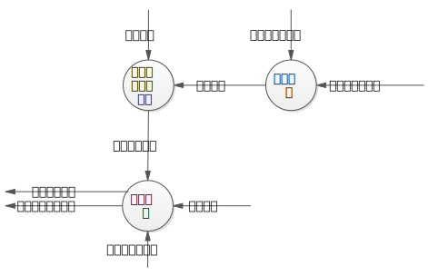

#### 功能结构图

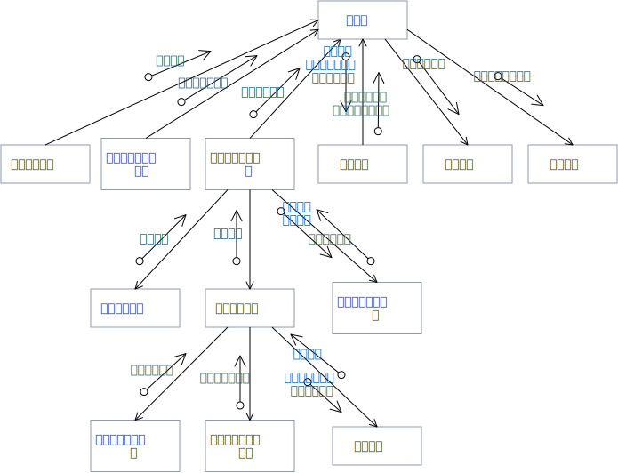

#### 功能模块说明

1. 模块名字 获取房间信息
  - 处理说明 “获取房间信息”模块可以获取信息，并将信息传递到主模块
  - 接口说明\
    PROCEDURE getRoominfo\
	INTERFACE RETURNS\
	TYPE Roominfo IS STRING\
	No external I/O or global data Used\
	Called by main\
	Calls no subordinate modules

2. 模块名字 获取主控机配置信息
  - 处理说明 “获取主控机配置信息”模块可以获取信息，并将信息传递到主模块
  - 接口说明\
    PROCEDURE getMconfigureinfo\
	INTERFACE RETURNS\
	TYPE Mconfigureinfo IS STRUCT\
	No external I/O or global data Used\
	Called by main\
	Calls no subordinate modules

3. 模块名字 获取调节请求记录
  - 处理说明 “获取调节请求记录”模块可以获取信息，并将信息传递到主模块
  - 接口说明\
    PROCEDURE getRequestRec\
	INTERFACE RETURNS\
	TYPE RequestRec IS STRUCT\
	No external I/O or global data Used\
	Called by main\
	Calls getAuth,getRequest,recvRequestInfo

4. 模块名字 获取使用授权
  - 处理说明 “获取使用授权”模块可以获取信息，并将信息传递到“获取调节请求模块”
  - 接口说明\
    PROCEDURE getAuth\
	INTERFACE RETURNS\
	TYPE Auth IS BOOL\
	No external I/O or global data Used\
	Called by getRequestRec\
	Calls no subordinate modules

5. 模块名字 获取调节请求
  - 处理说明 “获取调节请求”模块可以获取信息，并将信息传递到“获取调节请求记录模块”
  - 接口说明\
    PROCEDURE getRequest\
	INTERFACE RETURNS\
	TYPE Request IS STRUCT\
	No external I/O or global data Used\
	Called by getRequestRec\
	Calls getTempSpeed,getSconfigureinfo,adjust

6. 模块名字 获取目标风速温度
  - 处理说明 “获取目标风速温度”模块可以获取信息，并将信息传递到“获取调节请求模块”
  - 接口说明\
    PROCEDURE getTempSpeed\
	INTERFACE RETURNS\
	TYPE TempSpeed IS INTEGER\
	No external I/O or global data Used\
	Called by getRequest\
	Calls no subordinate modules

7. 模块名字 获取从控机配置信息
  - 处理说明 “获取从控机配置信息”模块可以获取信息，并将信息传递到“获取调节请求模块”
  - 接口说明\
    PROCEDURE getSconfigureinfo\
	INTERFACE RETURNS\
	TYPE Sconfigureinfo IS STRING\
	No external I/O or global data Used\
	Called by getRequest\
	Calls no subordinate modules

8. 模块名字 界面调节
  - 处理说明 “界面调节模块”获得从控机配置信息、目标温度和风速信息，并将他们转化为调节请求,将信息传递到“获取调节请求模块”
  - 接口说明\
    PROCEDURE adjust\
    INTERFACE ACCEPTS\
    TYPE information IS STRUCT\
    INTERFACE RETURNS\
    TYPE Request IS STRUCT\
    No external I/O or global data Used\
    Called by getRequest\
    Calls no subordinate modules

9. 模块名字 接收温度调节信息
  - 处理说明 “接收温度调节信息”获得从控机配置信息、目标温度和风速信息，并将他们转化为调节请求,将信息传递到“获取调节请求模块”
  - 接口说明\
    PROCEDURE recvRequestInfo\
    INTERFACE ACCEPTS\
    TYPE Auth IS BOOL\
    TYPE Request IS STRUCT\
    INTERFACE RETURNS\
    TYPE RequestRec IS STRUCT\
    No external I/O or global data Used\
    Called by getRequestRec\
    Calls no subordinate modules

10. 模块名字 负载均衡
   - 处理说明 “负载均衡”模块接收调解请求记录，主控机配置信息和房间信息，对空调请求做负载均衡处理，转化为空调运行状态和从控机及房间信息
   - 接口说明\
     PROCEDURE loadBalancing\
	 INTERFACE ACCEPTS\
     TYPE Roominfo IS STRING\
     TYPE Mconfigureinfo IS STRUCT\
     TYPE RequestRec IS STRUCT\
     INTERFACE RETURNS\
	 TYPE runningStatus IS STRUCT\
     TYPE slaveInfo IS STRUCT\
	 No external I/O or global data Used\
	 Called by main\
	 Calls no subordinate modules

11. 模块名字 给出空调运行状态
  - 处理说明 “给出空调运行状态”从主模块获得空调运行状态，给出结果
  - 接口说明\
    PROCEDURE resultRunningStatus\
	INTERFACE ACCEPTS\
	TYPE runningStatus IS STRUCT\
    No external I/O or global data Used\
	Called by main\
	Calls no subordinate modules

12. 模块名字 给出从控机及房间信息
  - 处理说明 “给出从控机及房间信息”从主模块获得从控机及房间信息，给出结果
  - 接口说明\
    PROCEDURE resultSlaveInfo\
	INTERFACE ACCEPTS\
    TYPE slaveInfo IS STRUCT\
	No external I/O or global data Used\
	Called by main\
	Calls no subordinate modules

### 子系统2：报表管理子系统

#### 数据流图

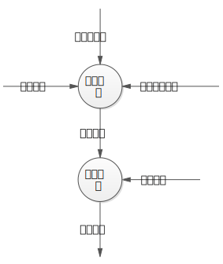

#### 功能结构图

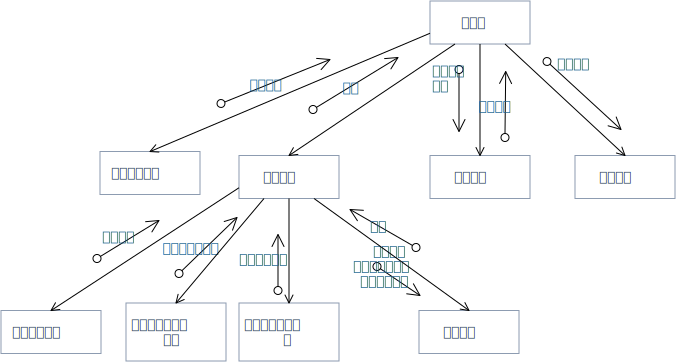

#### 功能模块说明

1. 模块名字 取得查询请求
  - 处理说明 “取得查询请求”模块可以获取信息，并将信息传递到主模块
  - 接口说明\
    PROCEDURE getSearchReq\
	INTERFACE RETURNS\
	TYPE SearchReq IS TIME\
	No external I/O or global data Used\
	Called by main\
	Calls no subordinate modules

2. 模块名字 获取报表
  - 处理说明 “获取报表”模块可以获取信息，并将信息传递到主模块
  - 接口说明\
    PROCEDURE getReport\
	INTERFACE RETURNS\
	TYPE Report IS STRUCT*\
	No external I/O or global data Used\
	Called by main\
	Calls getCost,getStartup,getRunningStatus,produceReport

3. 模块名字 获取能耗费用
  - 处理说明 “获取能耗费用”模块可以获取信息，并将信息传递到“获取报表模块”
  - 接口说明\
    PROCEDURE getCost\
	INTERFACE RETURNS\
	TYPE Cost IS DOUBLE\
	No external I/O or global data Used\
	Called by getReport\
	Calls no subordinate modules

4. 模块名字 获取从控机开机信息
  - 处理说明 “获取从控机开机信息”模块可以获取信息，并将信息传递到“获取报表模块”
  - 接口说明\
    PROCEDURE getStartup\
	INTERFACE RETURNS\
	TYPE Startup IS String\
	No external I/O or global data Used\
	Called by getReport\
	Calls no subordinate modules

5. 模块名字 获取空调运行状态
  - 处理说明 “获取空调运行状态”模块可以获取信息，并将信息传递到“获取调节请求模块”
  - 接口说明\
    PROCEDURE getRunningStatus\
	INTERFACE RETURNS\
	TYPE RunningStatus IS STRUCT\
	No external I/O or global data Used\
	Called by getReport\
	Calls no subordinate modules

6. 模块名字 生成报表
 - 处理说明 “接收温度调节信息”获得从控机配置信息、目标温度和风速信息，并将他们转化为调节请求,将信息传递到“获取调节请求模块”
 - 接口说明\
   PROCEDURE produceReport\
   INTERFACE ACCEPTS\
   TYPE Cost IS DOUBLE\
   TYPE Startup IS String\
   TYPE RunningStatus IS STRUCT\
   INTERFACE RETURNS\
   TYPE Report IS STRUCT*\
   No external I/O or global data Used\
   Called by getReport\
   Calls no subordinate modules

7. 模块名字 管理报表
 - 处理说明 “管理报表”模块接收报表和查询请求，根据查询请求查询报表，产生目标报表发送给主模块
 - 接口说明\
   PROCEDURE loadBalancing\
   INTERFACE ACCEPTS\
   TYPE Report IS STRUCT*\
   TYPE SearchReq IS TIME\
   INTERFACE RETURNS\
   TYPE targetReport IS STRUCT*\
   No external I/O or global data Used\
   Called by main\
   Calls no subordinate modules

8. 模块名字 给出目标报表
  - 处理说明 “给出目标报表”从主模块获得目标报表，给出结果
  - 接口说明\
    PROCEDURE resultTargetReport\
	INTERFACE ACCEPTS\
	TYPE targetReport IS STRUCT*\
    No external I/O or global data Used\
	Called by main\
	Calls no subordinate modules

### 子系统3：房间信息定时更新子系统

#### 数据流图

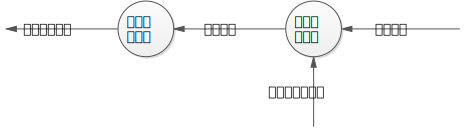

#### 功能结构图

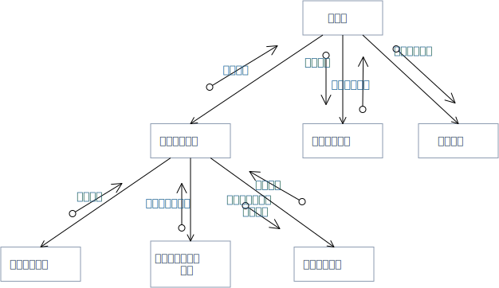

#### 功能模块说明

1. 模块名字 获取房间信息
  - 处理说明 "获取房间信息"模块可以获取房间温度和从控机配置信息，然后将这些信息发给"发送房间信息"模块，同时获取来自"发送房间信息"模块的返回房间信息
  - 接口说明\
        PROCEDURE getroominfo\
		INTERFACE ACCEPTS\
		TYPE roomtemp IS STRING\
        TYPE Cconfigureinfo IS STRING\
		INTERFACE RETURNS\
		TYPE roominfo IS STRING\
		No external I/O or global data Used\
		Called by main
		Calls getroomtemp,getCconfigureinfo and sendroominfo modules

2. 模块名字 获取房间温度
  - 处理说明 "获取房间温度"模块可以获取房间温度，并将其传给"获取房间信息"模块
  - 接口说明\
        PROCEDURE getroomtemp\
	    INTERFACE RETURNS\
	    TYPE roomtemp IS STRING\
	    No external I/O or global data Used\
	    Called by getroominfo\
	    Calls no subordinate modules

3. 模块名字 获取从控机配置信息
  - 处理说明 "获取从控机配置信息"模块可以获取从控机配置信息，并将其传给"获取房间信息"模块
  - 接口说明\
        PROCEDURE getCconfigureinfo\
	    INTERFACE RETURNS\
	    TYPE Cconfigureinfo IS STRING\
	    No external I/O or global data Used\
	    Called by getroominfo\
	    Calls no subordinate modules 
4. 模块名字 发送房间信息
  - 处理说明 "发送房间信息"模块接收来自"获取房间信息"模块的从控机配置信息和房间温度，并转化为房间信息返回给"获取房间信息"模块
  - 接口说明\
        PROCEDURE sendroominfo\
		INTERFACE ACCEPTS\
		TYPE Cconfigureinfo IS STRING\
        TYPE tempreture IS STRING\
		INTERFACE RETURNS\
		TYPE roominfo IS STRING\
		No external I/O or global data Used\
		Called by getroominfo
		Calls no subordinate modules 
 5. 模块名字 房间信息更新
   - 处理说明 "房间信息更新"模块获取来自主模块的房间信息，并将之转化为目标房间信息返回给主模块
   - 接口说明\
        PROCEDURE updateroominfo\
		INTERFACE ACCEPTS\
		TYPE roominfo IS STRING\
		INTERFACE RETURNS\
		TYPE targetroominfo IS STRING\
		No external I/O or global data Used\
		Called by main
		Calls no subordinate modules
 6. 模块名字 给出结果
    - 处理说明 "给出结果"模块接收来自主模块的目标房间信息，并给出结果
    - 接口说明\
        PROCEDURE giveresult\
		INTERFACE ACCEPTS\
		TYPE targetroominfo IS STRING\
		No external I/O or global data Used\
		Called by main
		Calls no subordinate modules
### 子系统4：房客信息管理子系统

#### 数据流图

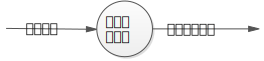

#### 功能结构图

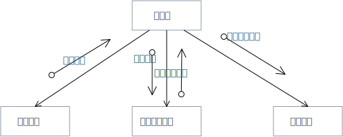
#### 功能模块说明

1. 模块名字 取得数据
  - 处理说明 "取得数据"模块可以获得房客信息并将该信息返回主模块
  - 接口说明\
        PROCEDURE getdata\
	    INTERFACE RETURNS\
	    TYPE guestinfo IS STRING\
	    No external I/O or global data Used\
	    Called by main\
	    Calls no subordinate modules
2. 模块名字 管理房客信息 
  - 处理说明 "管理房客信息"模块可以接收来自主模块的房客信息，并管理房客信息，及将他们返回给主模块
  - 接口说明\
        PROCEDURE manageinfo\
		INTERFACE ACCEPTS\
		TYPE guestinfo IS STRING\
		INTERFACE RETURNS\
		TYPE allguestinfo IS STRING\
		No external I/O or global data Used\
		Called by main\
		Calls no subordinate modules
3. 模块名字 给出结果
  - 处理说明 "给出结果"模块可以接收来自主模块的全部房客信息，并将之给出
  - 接口说明\
        PROCEDURE giveresult\
		INTERFACE ACCEPTS\
		TYPE allguestinfo IS STRING\
		No external I/O or global data Used\
		Called by main\
		Calls no subordinate modules

### 子系统5：实时信息查看子系统

#### 数据流图

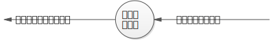

#### 功能结构图

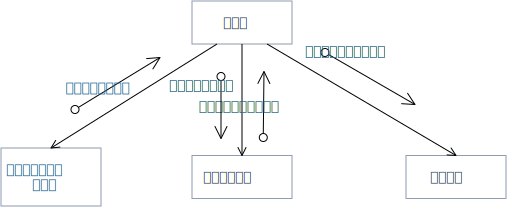
#### 功能模块说明

1. 模块名字 获取从控机及房间信息
  - 处理说明 “获取从控机及房间信息”模块可以获取信息，并将信息传递到主模块
  - 接口说明\
    PROCEDURE getClientinfoAndRoominfo\
	INTERFACE RETURNS\
	TYPE ClientinfoAndRoominfo IS STRING\
	No external I/O or global data Used\
	Called by main\
	Calls no subordinate modules
    
2. 模块名字 查看实时信息
  - 处理说明 “查看实时信息”模块获取来自主模块的从控机及房间信息，并将其转化为全部从控机及房间信息
  - 接口说明\
        PROCEDURE ViewingRealtimeInformation\
		INTERFACE ACCEPTS\
		TYPE ClientinfoAndRoominfo IS STRING\
		INTERFACE RETURNS\
		TYPE AllClientinfoAndRoominfo IS STRING\
		No external I/O or global data Used\
		Called by main\
		Calls no subordinate modules
3. 模块名字 显示结果
  - 处理说明 “显示结果”模块接收来自主模块的全部从控机房间信息，并将其进行显示
  - 接口说明\
        PROCEDURE showresult\
		INTERFACE ACCEPTS\
		TYPE AllClientinfoAndRoominfo IS STRING\
		No external I/O or global data Used\
		Called by main\
		Calls no subordinate modules

### 子系统6：配置空调参数子系统

#### 数据流图

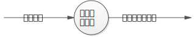

#### 功能结构图

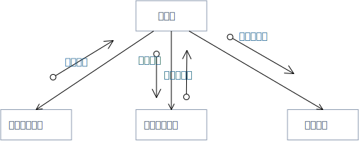
#### 功能模块说明
1. 模块名字 取得配置信息
  - 处理说明 “取得配置信息”模块可以获取信息，并将信息传递到主模块
  - 接口说明\
        PROCEDURE getconfigureinfo\
		INTERFACE RETURNS\
		TYPE configureinfo IS STRING\
		No external I/O or global data Used\
		Called by main\
		Calls no subordinate modules

2. 模块名字 配置空调参数
  - 处理说明 “配置空调参数”模块可以获取来自主模块的配置信息，并将其转化为主控机配置返回给主模块
  - 接口说明\
        PROCEDURE configureParameter\
		INTERFACE ACCEPTS\
		TYPE configureinfo IS STRING\
		INTERFACE RETURNS\
		TYPE Mconfigureinfo IS STRING\
		No external I/O or global data Used\
		Called by main\
		Calls no subordinate modules
3. 模块名字 给出结果
  - 处理说明 “给出结果”模块可以接收来自主控机的主控机配置信息，并将结果给出
  - 接口说明\
        PROCEDURE giveresult\
		INTERFACE ACCEPTS\
		TYPE Mconfigureinfo IS STRING\
		No external I/O or global data Used\
		Called by main\
		Calls no subordinate modules

### 子系统7：能耗费用计算子系统

#### 数据流图

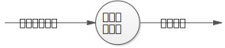

#### 功能结构图

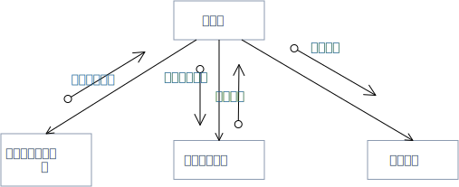

#### 功能模块说明
1. 模块名字 取得空调运行状态
  - 处理说明 "取得空调运行状态"模块可以获取空调运行状态，并将该信息传给主模块
  - 接口说明\
        PROCEDURE getrunstate\
		INTERFACE RETURNS\
		TYPE runstate IS STRING\
		No external I/O or global data Used\
		Called by main\
		Calls no subordinate modules

2. 模块名字 费用能耗计算
  - 处理说明 "费用能耗计算"模块可以接收来自主模块的空调运行状态信息，进行费用能耗计算，并将计算所得费用能耗返回给主模块
  - 接口说明\
        PROCEDURE computecost\
		INTERFACE ACCEPTS\
		TYPE runstate IS STRING\
		INTERFACE RETURNS\
		TYPE cost IS STRING\
		No external I/O or global data Used\
		Called by main\
		Calls no subordinate modules
3. 模块名字 给出结果
  - 处理说明 "给出结果"模块可以接收来自主控机的费用能耗，并将结果给出
  - 接口说明\
        PROCEDURE givere\
		INTERFACE ACCEPTS\
		TYPE cost IS STRING\
		No external I/O or global data Used\
		Called by main\
		Calls no subordinate modules
        
### 子系统8：从控机信息显示子系统

#### 数据流图

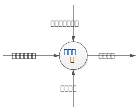

#### 功能结构图

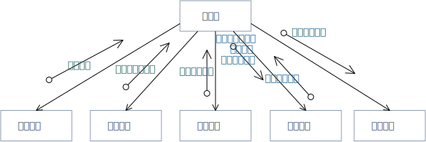

#### 功能模块说明

> 为功能结构图中每一个模块写一份处理说明和一份接口说明

1. 模块名字 取得数据
  - 处理说明 "取得数据"模块可以获得能耗费用、从控机配置信息和空调运行状态，并将该信息返回主模块
  - 接口说明\
        PROCEDURE getdata\
	    INTERFACE RETURNS\
	    TYPE cost,Cconfigureinfo,runstate IS STRING\
	    No external I/O or global data Used\
	    Called by main\
	    Calls no subordinate modules 
2. 模块名字 显示信息
  - 处理说明 "显示信息"模块可以获得来自主模块的能耗费用、从控机配置信息和空调运行状态信息，并将它们转化为空调房间状态返回主模块
  - 接口说明\
        PROCEDURE showinfo\
		INTERFACE ACCEPTS\
		TYPE cost,Cconfigureinfo,runstate IS STRING\
		INTERFACE RETURNS\
		TYPE roomstate IS STRING\
		No external I/O or global data Used\
		Called by main\
		Calls no subordinate modules
 3. 模块名字 给出结果
   - 处理说明 "给出结果"模块接收来自主模块的空调房间状态，并给出结果
   - 接口说明\
        PROCEDURE giveresult\
		INTERFACE ACCEPTS\
		TYPE roomstate IS STRING\
		No external I/O or global data Used\
		Called by main
		Calls no subordinate module
### 子系统9：从控机登录认证子系统

#### 数据流图

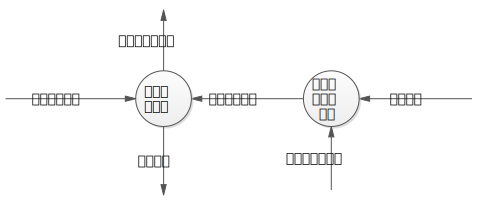

#### 功能结构图

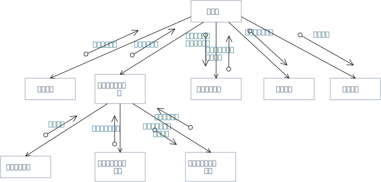

1. 模块名字 取得数据
  - 处理说明 "取得数据"模块将获取的目标房客信息返回主模块
  - 接口说明\
        PROCEDURE getdata\
	    INTERFACE RETURNS\
	    TYPE targetroommateinfo IS STRING\
	    No external I/O or global data Used\
	    Called by main\
	    Calls no subordinate modules 
2. 模块名字 获取登录信息
  - 处理说明 “获取登录信息”模块可以获取信息，并将信息传递到"获取身份认证信息"模块
  - 接口说明\
        PROCEDURE getlogoninfo\
		INTERFACE RETURNS\
		TYPE logoninfo IS STRING\
		No external I/O or global data Used\
		Called by getauthinfo\
		Calls no subordinate modules
 3. 模块名字 取得从控机配置信息
  - 处理说明 “取得从控机配置信息”模块可以获取从控机配置信息，并将信息传递到"获取身份认证信息"模块
  - 接口说明\
        PROCEDURE getCconfigureinfo\
		INTERFACE RETURNS\
		TYPE Cconfigureinfo IS STRING\
		No external I/O or global data Used\
		Called by getauthinfo\
		Calls no subordinate modules
 4. 模块名字 
  - 处理说明 “取得从控机配置信息”模块可以获取从控机配置信息和登录信息，并将身份认证信息返回到"获取身份认证信息"模块
  - 接口说明\
        PROCEDURE showinfo\
		INTERFACE ACCEPTS\
		TYPE cost,Cconfigureinfo,runstate IS STRING\
		INTERFACE RETURNS\
		TYPE roomstate IS STRING\
		No external I/O or global data Used\
		Called by main\
		Calls no subordinate modules
 5. 模块名字 获取身份认证信息
  - 处理说明 "获取身份认证信息"模块可以获取身份认证信息，并将之传递给主模块
  - 接口说明\
        PROCEDURE getauthinfo\
		INTERFACE ACCEPTS\
		TYPE logoninfo IS STRING\
		INTERFACE RETURNS\
		TYPE logoninfo IS STRING\
		No external I/O or global data Used\
		Called by main\
		Calls getlogoninfo,getCconfigureinfo modules
 6. 模块名字 房客登录认证
  - 处理说明 "房客登录认证"模块可以获取来自主模块的目标房客信息和身份认证信息，并在完成登录认证之后将从控机开机信息和使用授权返回主模块
  - 接口说明\
        PROCEDURE auth\
		INTERFACE ACCEPTS\
		TYPE targetroommateinfo,logoninfo IS STRING\
		INTERFACE RETURNS\
		TYPE Coninfo,useauth IS STRING\
		No external I/O or global data Used\
		Called by main\
		Calls no subordinate modules
 7. 模块名字 给出结果
   - 处理说明 "给出结果"模块接收来自主模块的从控机开机信息和使用授权，并给出结果
   - 接口说明\
        PROCEDURE giveresult\
		INTERFACE ACCEPTS\
		TYPE Coninfo,useauth IS STRING\
		No external I/O or global data Used\
		Called by main
		Calls no subordinate module
## 系统级初始功能结构图

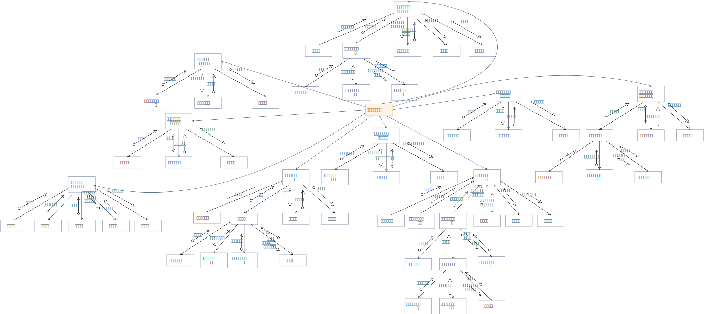

## 优化后的系统级功能结构图

> 基于初始功能结构图，按照启发式原则进行某些模块的合并和优化，使其满足“高内聚低耦合”特性，形成最终的可执行的系统功能结构图，是详细设计和编码的依据。

## 数据设计

> 本节给出数据库逻辑结构设计，给出系统各个模块需要的全局数据结构

### 数据库设计

#### E-R图

> 将基于结构化数据流图的《需求分析规格说明书》中ER图直接拷贝过来，无须进行修改。

#### 数据库表结构

> 根据ER图，设计出对应的表结构

##### 计费参数维护表

Table | xxx
--|--
Version |
Purpose |
Primary Key |
Foreign Key |
Index |

Column | Type | Length | NULL | Illustration
--|--|--|--|--

#### 数据表关系

### 全局数据结构设计

> 给出系统全局数据结构设计，包括全局常量和全局变量，说明每个数据结构的作用。